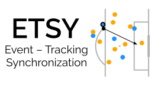

<div align="center">



<br/>
<br/>


[](https://opensource.org/license/apache-2-0/)

</div>

## What is it?

**ETSY** is a rule-based synchronization algorithm to **synchronize soccer event data with** its corresponding **tracking / positional data**. 
The algorithm synchronizes each playing period separately using two steps:

1. *Synchronize kickoff*: removes the constant time-bias due to the clocks in the event and tracking data not starting at the same time.
2. *Synchronize remaining events using rule-base*: uses event-specific rules and a distance-based score function to identify the best matching frame within a selected time window around each event. 

## Installation

You can install ETSY directly from GitHub.

```sh
# Clone the repository
$ git clone git://github.com/ML-KULeuven/ETSY.git
$ cd ETSY
# Create a virtual environment
$ python3 -m venv venv_name
$ source venv_name/bin/activate
# Install the package and its dependencies
$ pip install .
```

## Data Format

ETSY relies on the [SPADL representation](https://github.com/ML-KULeuven/socceraction) for the event data. The exact format of the required event and tracking data is specified in `etsy/schema.py`. Your event and tracking data should be converted to this schema before using ETSY.

## Example Use

```python
from etsy import sync

# Initialize event-tracking synchronizer with given event data (df_events), 
# tracking data (df_tracking), and recording frequency of the tracking data (fps_tracking)
ETSY = sync.EventTrackingSynchronizer(df_events, df_tracking, fps=fps_tracking)

# Run the synchronization
ETSY.synchronize()

# Inspect the matched frames and scores
print(ETSY.matched_frames)
print(ETSY.scores)
```

## Research

If you make use of this package in your research, please consider citing the following paper:

- Maaike Van Roy, Lorenzo Cascioli, and Jesse Davis. **ETSY: A rule-based approach to Event and Tracking data SYnchronization**. In Machine Learning and Data Mining for Sports Analytics ECML/PKDD 2023 Workshop (2023). <br/>[ [bibtex](./docs/etsy.bibtex) ]


## License

Distributed under the terms of the [Apache License, Version 2.0](https://opensource.org/license/apache-2-0/), ETSY is free and open source software. Although not strictly required, we appreciate it if you include a link to this repo or cite our research in your work if you make use of it.


